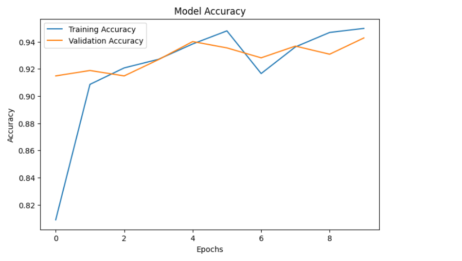
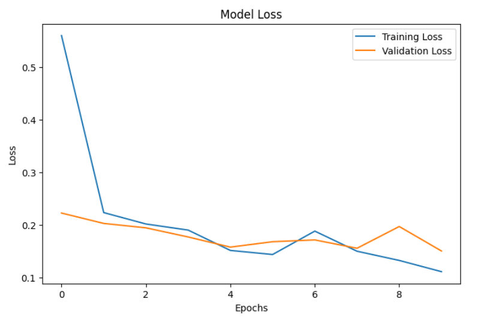
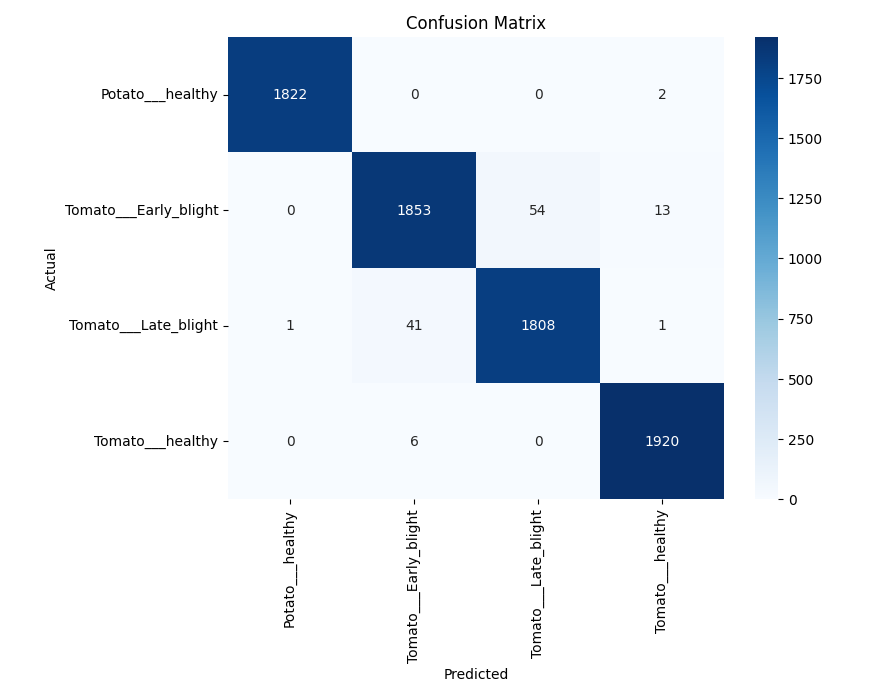
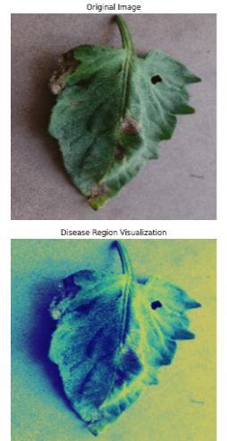
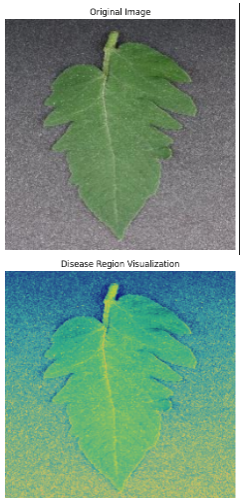

# 🌱 Plant Leaf Disease Detection Using VGG16 Transfer Learning and Grad-CAM Visualization

Plant diseases significantly impact agricultural productivity and food security worldwide. Early and accurate disease detection can help farmers take timely preventive measures and reduce crop losses.

This project presents a deep learning-based plant leaf disease detection system built using the VGG16 Transfer Learning architecture. To enhance model interpretability, Grad-CAM (Gradient-weighted Class Activation Mapping) is integrated, allowing visualization of the regions that influence model predictions.

The model is trained on a publicly available plant disease dataset and demonstrates the effectiveness of transfer learning for agricultural image classification tasks.

---

## Objectives

* Develop an automated plant leaf disease classification system.
* Leverage VGG16 Transfer Learning to improve classification performance.
* Apply data augmentation techniques for better model generalization.
* Evaluate model performance using standard classification metrics.
* Visualize model decision-making using Grad-CAM explainability techniques.

---

## Dataset

This project utilizes the **New Plant Diseases Dataset (Augmented)** from Kaggle, a widely used benchmark dataset for plant disease classification and computer vision research in agriculture.

### Dataset Source

Dataset Link:
https://www.kaggle.com/datasets/vipoooool/new-plant-diseases-dataset

### Dataset Description

The dataset contains thousands of high-quality plant leaf images belonging to multiple crop species and disease categories. It includes both healthy and diseased leaf samples, making it suitable for multi-class image classification tasks.

### Key Characteristics

* Multiple plant species
* Healthy and diseased leaf images
* Multi-class classification problem
* Augmented training images
* Real-world agricultural disease identification use case

### Data Preparation

The dataset images were preprocessed using image resizing and normalization techniques. Data augmentation was applied through TensorFlow's `ImageDataGenerator` to improve model generalization and reduce overfitting.

### Purpose

The dataset was used to train and evaluate a VGG16 Transfer Learning model capable of automatically identifying plant diseases from leaf images while providing explainable predictions through Grad-CAM visualization.


---

## Technologies Used

* Python
* TensorFlow
* Keras
* OpenCV
* NumPy
* Pandas
* Matplotlib
* Scikit-Learn

---

## Methodology

1. Data Collection and Preprocessing
2. Image Augmentation
3. Transfer Learning with VGG16
4. Model Training and Validation
5. Performance Evaluation
6. Grad-CAM Visualization
7. Prediction Analysis

---

## Key Features

Automated Plant Disease Classification

Transfer Learning with Pre-trained VGG16

Image Data Augmentation

Model Evaluation and Performance Analysis

Grad-CAM Explainable AI Visualization

Deep Learning-Based Agricultural Decision Support

---

## Results

The trained model achieved strong classification performance on plant disease images and successfully identified disease-affected regions using Grad-CAM visualizations.

### Training Accuracy



### Training Loss



### Confusion Matrix



### Grad-CAM Visualization





---

## Development Environment

```bash
This project was developed and trained using Google Colab with TensorFlow and Keras. Google Colab's GPU environment was utilized to accelerate model training and improve model performance.
```

---

## How to Run

```bash
1. Download the Plant Village dataset from the Kaggle link provided in this repository.
2. Upload the dataset to your Google Drive.
3. Open the Plant_Disease_Detection.ipynb notebook in Google Colab.
4. Update dataset paths if necessary.
5. Run all notebook cells sequentially.
6. View model training results, evaluation metrics, predictions, and Grad-CAM       visualizations.

The notebook contains the complete workflow, including data preprocessing, model training, evaluation, and explainable AI visualization using Grad-CAM.
```

Run all cells sequentially to train the model and generate predictions and Grad-CAM visualizations.

---

## Future Improvements

* Deployment as a Web Application
* Real-Time Disease Detection
* Mobile-Based Prediction System
* Multi-Crop Disease Monitoring
* Integration with Precision Agriculture Platforms

